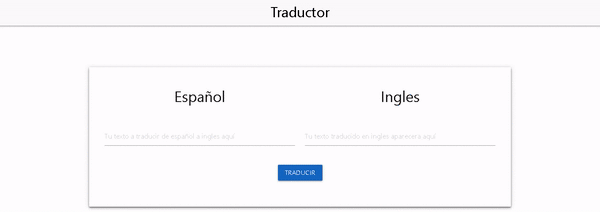
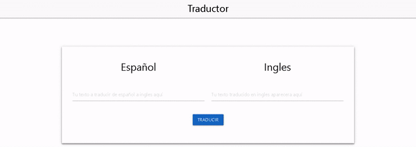

# Spanish-to-English Translator

A web translation experiment built with **Node.js, Express, EJS, and Puppeteer**. Enter Spanish text in the browser; the server opens Google Translate in a headless browser and extracts the English result.

This is a historical browser-automation project. It uses Puppeteer 1.x and page-specific selectors rather than an official translation API. The examples below show earlier behavior; current end-to-end translation has not been verified.

## Examples





## Run locally

Install Node.js and npm, then run:

```sh
git clone https://github.com/EladioRocha/translator-master.git
cd translator-master
npm ci
npm start
```

Open `http://localhost:3000`. Enter Spanish text and select **Translate**. An empty input uses `Hola mundo` as the example text.

The server uses `PORT` from the process environment, falling back to `3000`. It does not load a `.env` file. The repository does not pin a Node.js version; its older dependencies may require compatibility work on a modern runtime.

## Request flow

1. `GET /` renders the EJS interface.
2. The browser sends the input to `GET /translate/:text`.
3. Puppeteer launches a browser and opens the Spanish-to-English Google Translate page.
4. The controller waits for a result element and returns JSON with a `text` field.
5. The interface displays the returned translation.

## Project structure

| Path | Purpose |
| --- | --- |
| [app.js](app.js) | Express configuration, static assets, and server port. |
| [routes/index.js](routes/index.js) | Page and translation routes. |
| [api/controllers/controllerIndex.js](api/controllers/controllerIndex.js) | Browser automation and result extraction. |
| [views/index.ejs](views/index.ejs) | Translation interface. |
| [public/js/index.js](public/js/index.js) | Input handling and requests. |
| [examples](examples) | Original animated demonstrations. |

## Commands and limitations

- `npm start` runs `node app.js`.
- `npm run dev` expects `nodemon`, which is not declared as a dependency. Use `npm start` for the documented setup.
- `npm test` is a placeholder and exits with an error.
- Internet access and a compatible Chromium installation are required by the translation flow.
- Changes to Google's markup or access controls can break the selector. Requests do not have a complete error-handling path, and each translation launches a browser.
- The source and destination languages are fixed in the controller. This is not a general multilingual translation service.

For a syntax-only check that does not contact Google, run `node --check app.js` and `node --check api/controllers/controllerIndex.js`.
